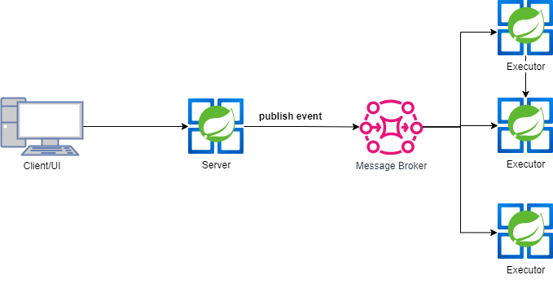

# Collaborative Code Editor

## Overview

This project is a collaborative code editor application, allowing multiple users to connect to a common code editor and write code together in real-time. The application is built with Spring Boot on the backend and React on the frontend, utilizing WebSockets for real-time communication and Kafka for task management.

## Features

- Real-time collaborative code editing
- Code execution service with microservice architecture
- Task handling using Kafka message broker
- WebSocket integration for real-time updates
- RESTful APIs for other operations

## Technology Stack

### Backend
- Spring Boot
- WebSocket
- REST
- Kafka

### Frontend
- React
- socket.js
- stomp.js
- axios

## Architecture Diagram



## Getting Started

### Prerequisites

- Java 21
- Node.js
- Docker
- Kafka

### Installation

1. **Clone the repository:**
   ```sh
   git clone https://github.com/mahiimc/Codeditor.git
   cd Codeditor

2. **Build Backend**   
   ```sh
    cd server
   ./mvnw clean install
   ```
3. **Build Frontend**
   ```sh
    cd ../ui
    npm install
    npm run build
   ```

4. **Build Executor**
   ```sh
    cd ../executor
   ./mvnw clean install
   ```
5. **Setup Kafka**

    __NOTE__: Make sure your docker engine running
    ```sh
    cd ../docker
    docker compose -f kafka-cluster up -d
    ```
6. **Start Backend Application**

    ```sh
    cd ../server
    ./mvnw spring-boot:run
    ```
6. **Start Executor Application**

    ```sh
    cd ../executor
    ./mvnw spring-boot:run
    ```
7. **Start Client Application**

    ```sh
    cd ../ui
    npm start
    ```

